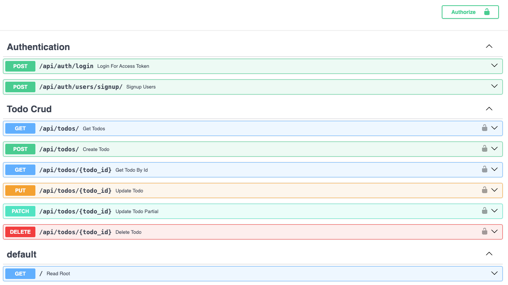

# Cal AI: MultiUser AI Powered Personal ToDo Web App

### An End to End Cloud GenAI MultiUser Project.
A simple Gen AI Powered AI First Microsrvice and Frontend Showcasing the Architecture for API forst Modern Web.

+ Layered Architecture Development
+ Gen AI Powered API Microservice & NextJS14 Frontend
+ Serverless Posgtgress Database Powered with SQL ALCHEMY ORM
+ Pytests for Unit Tests, API Tests and End to End Tests

Deployments:
- FastAPI Backend is dockerized and deplyed on Google Run
    - User Signup And Login Auhtication using OAuth Protocol
    - Authenticatied TODOs Crud
- Streamlit F.E is deployed on streamlit
- NextJS14 F.E is deployed on Vercel

#### The Inspiration
Starting from a simple todo app here I will be adding all features I wanted in any task mangement web app I have tried. 

This is more like a project build for personal use and open sourced for others to learn and maybe try using it.

*** Note: The Project is UnderProgress.

#### Endpoints



#### Streamlit Protype

#### Implementes Authentication and Todos Crud Prototype

#### In progress Features

- A Notion like Weekly to do list where I can add each week todos
    - At week end the sheet is deleted while the todos are saved in database.
    - AI can talk or inform in text about my daily tasks
    - At week end ana analysization about what I did and a segregation showing
        1. Time Spend on learning
        2. Recursive Tasks
        etc....

- Whatsapp, Skype or Slack message/notifications about daily work

### Features To Add in the future

#### Adaptive Task Prioritization:

- Problem: Users struggle with constantly changing priorities and task overload.
- AI Solution: Implement an AI algorithm that learns from the user's task completion patterns and adjusts task priorities accordingly. For instance, if a user consistently prioritizes work-related tasks in the mornings, the app could automatically adjust future task priorities.
Predictive Scheduling and Reminders:

------------------------------------

- Problem: Users often underestimate the time required for tasks or forget deadlines.
- AI Solution: AI could analyze past task completion times and suggest realistic timeframes for new tasks. It could also anticipate and remind users of recurring tasks based on historical data.
Integration with Other Tools:

------------------------------------

- Problem: Current apps often exist in isolation, not syncing well with other productivity tools.
- AI Solution: Develop AI capabilities to integrate and sync data with other apps (like calendars, emails) to provide a unified task management system. For example, AI can suggest to-do items from emails or meetings scheduled in the calendar.
Context-Aware Suggestions:

------------------------------------

- Problem: Users receive generic task suggestions that might not align with their current context or needs.
- AI Solution: Utilize AI to offer context-aware suggestions, like recommending grocery shopping when the user is near a supermarket, based on location data and past behavior.
Voice-Activated Controls:

------------------------------------

- Problem: Manual entry of tasks can be cumbersome.
- AI Solution: Implement sophisticated voice recognition to allow users to add tasks hands-free, enhancing accessibility and convenience.

------------------------------------

## Run Migrations One Time Using Alembic

Reason: It's recommended in SQLAlchemcy documentation to use alembic for db migrations in big projects.

We are using Neon Serverless Postgress Database and SQL Alchemy ORM.

Run Migratiosn: 

1. `alembic init migrations`

In alembic.ini rm the url here sqlalchemy.url = 

In migrations/env.py import dotenv and then:

config = context.config

###### ---------------- added code here -------------------------#
###### this will overwrite the ini-file sqlalchemy.url path
###### with the path given in the config of the main code

`config.set_main_option("sqlalchemy.url", os.environ.get("DB_URL"))`

Replace # target_metadata = None with 

```
from app.data sqlalchemy_models
target_metadata = sqlalchemy_models.Base.metadata
```

Here I made fastapi_backend a module and then used an absolute import above.

2. `alembic revision --autogenerate -m "Add Todos Table`

3. `alembic upgrade head`

Helpful Reference:
https://ahmed-nafies.medium.com/fastapi-with-sqlalchemy-postgresql-and-alembic-and-of-course-docker-f2b7411ee396

## Docker Commands
