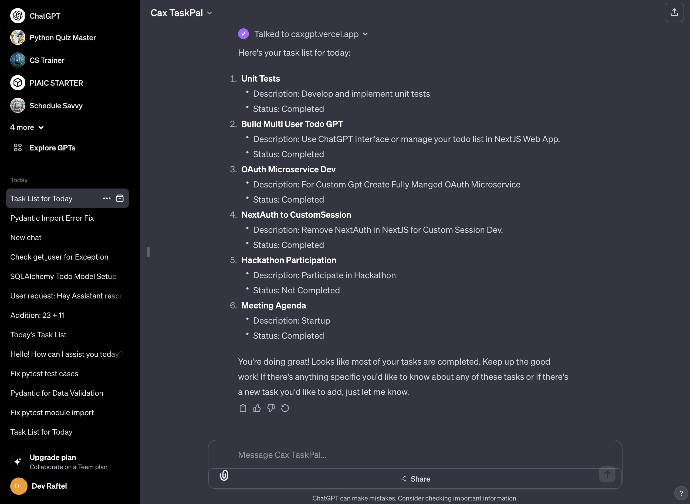
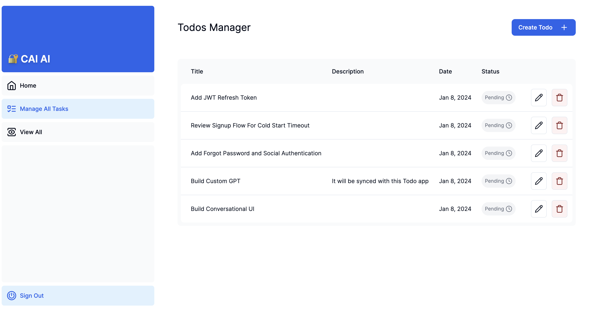
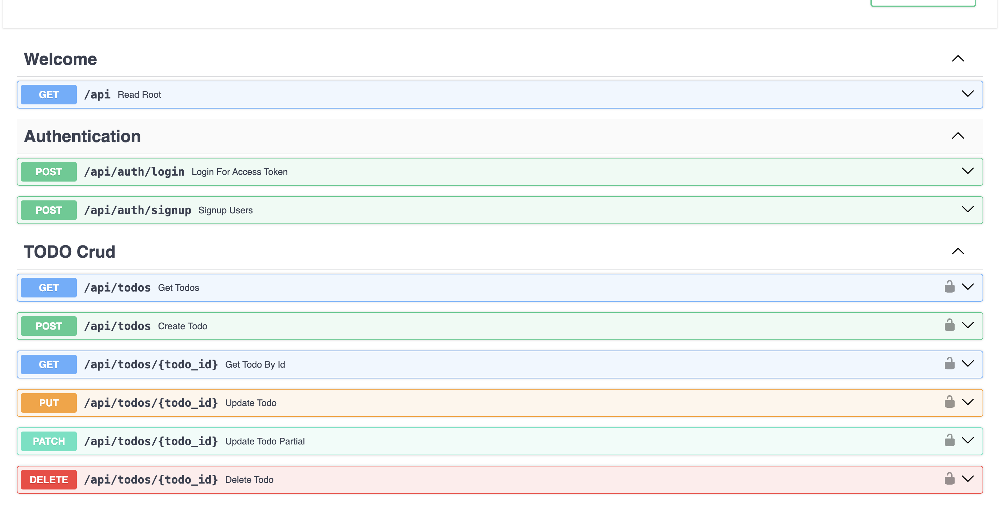
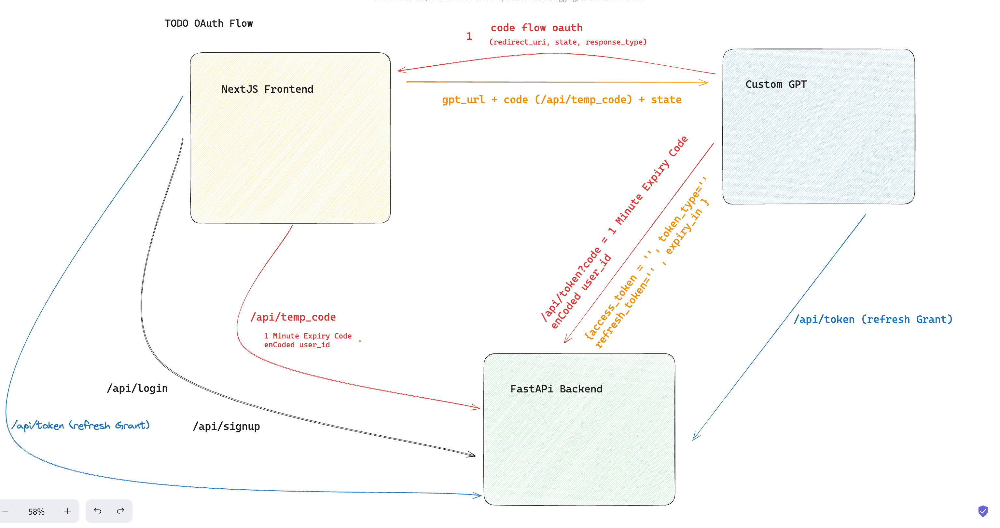

# CaX: Applied GenAI Multi User Todo GPT App

Chat or Talk with TasksPal GPT on ChatGPT interface and review the updates live NextJS Web App :D

A. NextJS Web Interface

https://caxgpt.vercel.app/

B. ChatGPT Cax TasksPal GPT

https://chat.openai.com/g/g-fC8sZoDCi-cax-taskpal

The FastAPI includes fully managed oAuth service to manage multi users efficiently.

## How it Works?

The Custom GPT is connected to FastAPI microservice and using OAuth Authorization Code Flow Scheme for authentication & authorization.

Backend Microservice and Frontend are developed in NextJS14 & Fastapi and deployed on Vercel. 

###### Live Code WalkThrough And Demo:

[](https://www.youtube.com/embed/q_LwcflLUrQ)

### Custom GPT Interface (Chat or Talk to Manage Tasks)



### NextJS User Dashboard



### FastAPI Microservice Endpoints



## Features And Tech Stack

1. Backend: FastAPI for efficient and scalable backend microservoice.
2. Frontend: Next.js14 for a responsive and dynamic user interface.
3. Custom GPT: Chat or talks to manage all your tasks.

### NextJS14
- Use Server Actions for all User Actions
- Middleware andCustom Authentication Flow Using FastAPI Backend OAuth service to implement user Authentication & Secure Routes
- Streaming and Suspense to enchance UI
- A custom todos management dashboard for all users
- Shadcn UI and Tailwind Css for UI engineering

### Cax TaskPal Custom GPT

- The Custom Actions Are configured using OpenAI Spec
- To Manage MultiUsers we are using OAuth Code Flow Authorization Scheme.
- This Custom GPT can view all todos, add new tasks to list, update and delete them. 
- User can manage todos themselves with nextjs14 web app.

##### Fun Fact: You can even call Custom GPT from mobile app and perform all these todo crud operations.

### FastAPI Microservice
- OAuth Protocol for User registration and authentication
- CRUD operations for todos
- Efficently handle Database Connections (open & close sessions for users)
- OAuth Code Flow Authorization for Custom GPT to implement authentication and security
- Configured Alembic to generate database schema and run migrations
- SqlAlchemy ORM and Neon Serverless Postgress SQL Database 
- Complete Unit, End to End and Integration tests using pytest and uttitest
    - Unit Tests: 44
        - web layer: 23
        - service layer: 13
        - data layer: 8
    - End-to-End (E2E) Tests: 17
    - Integration Tests: 2

`root api directoy: Contains the FastAPI backend microservice code, including API routes, models, and database configurations.`

Here's quick overview of how oAuth works with Custom GPT here:




## Running the Project Locally 

These instructions will get you a copy of the project up and running on your local machine for development and testing purposes.

#### 1. Clone the project

```
https://github.com/mjunaidca/....
```

 Run pnpm install to install the missing dependencies

#### 2. Add Environment Variables

Rename .env.template to .env and add environment variables. 
1. For `DB` we are using SQL ALchemy ORM so you can add any database url. I will recommend vercel postgress or neon serverless postgress database. 
2. For `BACKEND_URL` during local testing and http://localhost:3000 and in production add vercel deplyment url.

#### 3. Run Database Migrations

In terminal run:

- `alembic revision --autogenerate -m "Add Todos Table`

- `alembic upgrade head`

#### 4. Run Project Locally

Run pnpm install to install the missing dependencies

#### 5. Vercel Deplyment

Delete the .next and __pucache__ and .mypy... cache files and follow the steps:

a. Run `vercel link` and then add all env variables to vercel deplyment. Replace the localhost vars with vercel deoloyment link

b. Finally run `vercel --prod` to deploy the project.


## Testing
This project includes 44 unit tests, 17 end-to-end tests, and 2 integration tests to ensure software quality and reliability.

## The Inspiration
Inspired by the need for a personalized, AI-driven task management tool, this project is a journey towards creating an app that not only assists in managing daily tasks but also learns and adapts to the user's lifestyle and preferences.

## Thoughts & Contributions

Feel free to ask any questions or provide feedback. Contributions are also welcome!

## Helpful Resources for Custom GPT OAuth Dev.

OAuth 2.0 Authorization Code Grant Type

- https://developer.okta.com/blog/2018/04/10/oauth-authorization-code-grant-type#:~:text=The%20Authorization%20Code%20Grant%20Type,used%20OAuth%202.0%20grant%20types.

The Token URL Response:

- https://community.openai.com/t/guide-how-oauth-refresh-tokens-revocation-work-with-gpt-actions/533147

Understand oauth code flow

- https://www.oauth.com/oauth2-servers/single-page-apps/

Authorization Code Grant

- https://www.oauth.com/oauth2-servers/server-side-apps/authorization-code/

How OAuth refresh tokens & revocation work with GPT Actions

- https://community.openai.com/t/guide-how-oauth-refresh-tokens-revocation-work-with-gpt-actions/533147

#### To Study:

- https://auth0.com/docs/get-started/authentication-and-authorization-flow/authorization-code-flow
- https://auth0.com/docs/get-started/authentication-and-authorization-flow/authorization-code-flow-with-proof-key-for-code-exchange-pkce
- https://auth0.com/docs/get-started/authentication-and-authorization-flow/device-authorization-flow
- https://auth0.com/docs/get-started/authentication-and-authorization-flow/which-oauth-2-0-flow-should-i-use
